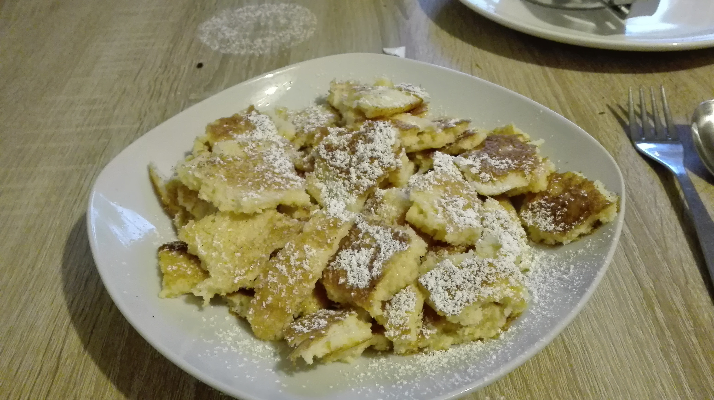

#dessert 

* **Zeit:**  30min
* **Personen:** 2

# Zutaten
* 250ml Milch
* 150g Mehl
* Sahne nach belieben
* 4 Eier

* Apfelmus
* Puderzucker

## Werkzeug
* Mixer
* 2 Schüsseln
* Pfanne

# Zubereitung
1. Eigelb und Eiweiss voneineander trennen, Eischnee aus dem Eiweis machen
2. Zu dem Eigelb, Mehl, Milch und Sahne hinzugeben.
3. Eischnee unterheben
4. In der Pfanne (mittlere Hitze) jeweils 3 Schöpflöffel Teig anbraten.
5. Mit Gabeln die fertigen Pfannkuchen in kleine Stücke teilen
6. Wenn es noch warm ist mit Puderzucker besträuen
7. Mit Apfelmus servieren