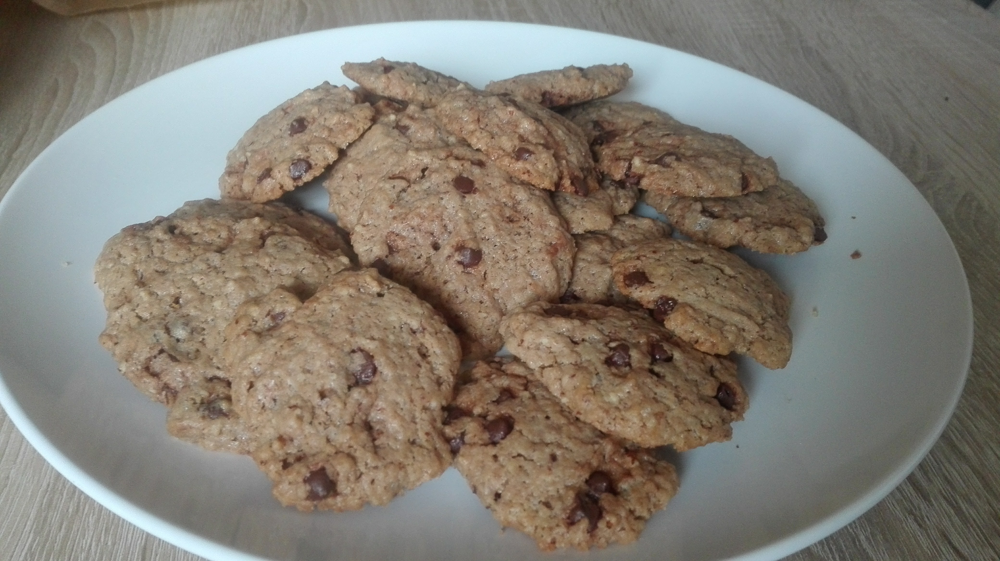

# Chocolate Chip Cookies
* **Zeit:**  20min + Backzeit
* **Personen:** 2

*Source:* [USA kulinarisch](http://www.usa-kulinarisch.de/rezept/chocolate-chip-cookies-schokoladenkekse/)

# Zutaten
* 250g Butter
* 250g brauner Zucker
* 1 Päckchen Vanillezucker
* 2 Eier
* 2 TL Backpulver
* 1 TL Natron
* 350g Mehl
* 75g gemahlene Mandeln
* 150g Chocolate Chips ([Hershey's](http://amzn.to/2jbE6ec), [Kirkland](http://amzn.to/2jOjDx6))

## Werkzeug
* 2 Schüsseln
* Rührmaschine
* Backpapier

# Zubereitung
1. Warme Butter und Zucker und Vanillezucker lange in der Rührmaschine vermischen
2. Eier dazu geben
3. Backpulver, Natron, Mehl, Madeln in einer weiteren Schüssel vermischen
4. Mehl Mischung mit in die Rührmaschine geben.
5. Sind alle Zutaten vermischt, dann die Chocolate Chips unterheben
6. Mit einem Teelöffel Kugeln bilden und auf einem Backpapier grösszügig verteilen (max 4 x 4 / Blech)
7. bei 170Grad Umluft 12min backen