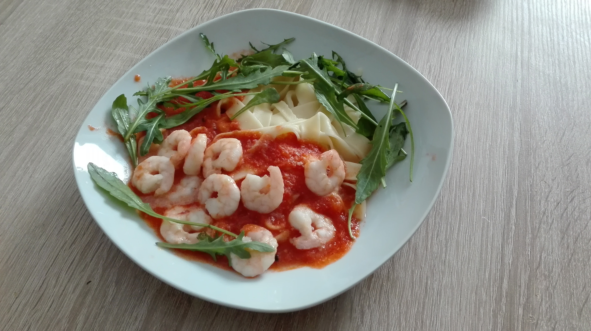

# Linguine mit Garnelen
* **Zeit:**  30min
* **Personen:** 2

*Source:* Jamies Wohlfühl Küche

## Zutaten
* 500g Garnelen
* 1 Zwiebel
* 2 Knoblauchzehen
* 1 Dose Sardellen
* 1 Dose Tomaten
* Rucola

* 250g Linguine

* 1 Chillishote
* Zitronensaft

# Werkzeug
* 2 Topf
* 1 Pfanne
* Mixer

# Zubereitung
1. Zwiebeln kleinhacken
2. Zwiebeln im Topf glasig anbraten, Knoblauch dazupressen
3. Sardellen, Dose Tomaten, Dose mit Wasser füllen, hinzugeben, Salz und Pfeffer (10min köcheln lassen)
4. Währendddessen In der Pfanne die Garnelen anbraten
5. Währenddessen In einem Topf mit Salzwasser die Linguine zubreiten
6. In einem Mixer die Sauce durchmixen
7. Mit Rucola und einem Schuss Zitronensaft servieren