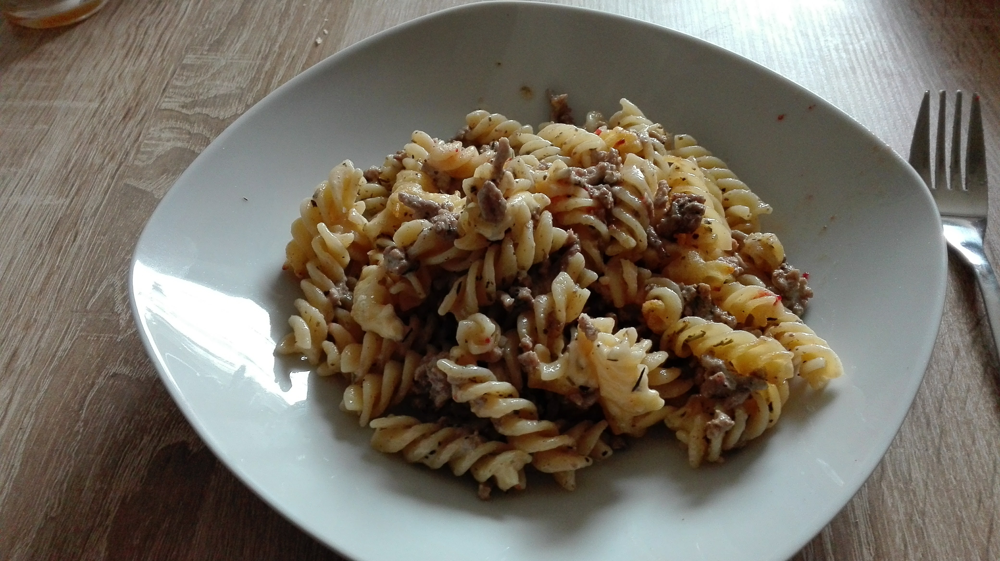

# Zapekana 
* **Zeit:** 30min  
* **Personen:** 2

# Zutaten
* Fussili
* 250g Hackfleisch
* Sahne
* Gouda

* Knoblauch
* Hühnchenbrühe
* Rosmarin

## Werkzeug
* Auflaufform

# Zubereitung
1. Fussili kochen
2. Zwiebeln + Knoblauch (Zwiebeln braun)
3. Hackfleisch dazu (bisschen Wasser hinzu, damit es nicht klebt) (Mit einer Gabel zerdrücken)
4. Eine Priese Hünchen Brühe
5. Halben Becher Schlagsahne + Pfeffer
6. Rosmarin (Blätter, je mehr Kräuter je besser)
7. Backform mit Margarine einfetten
8. Nudeln in die Backform geben
9. Hackfleisch in die Backform geben (bisschen Sahne dazu geben)
10. Käse drauftun
